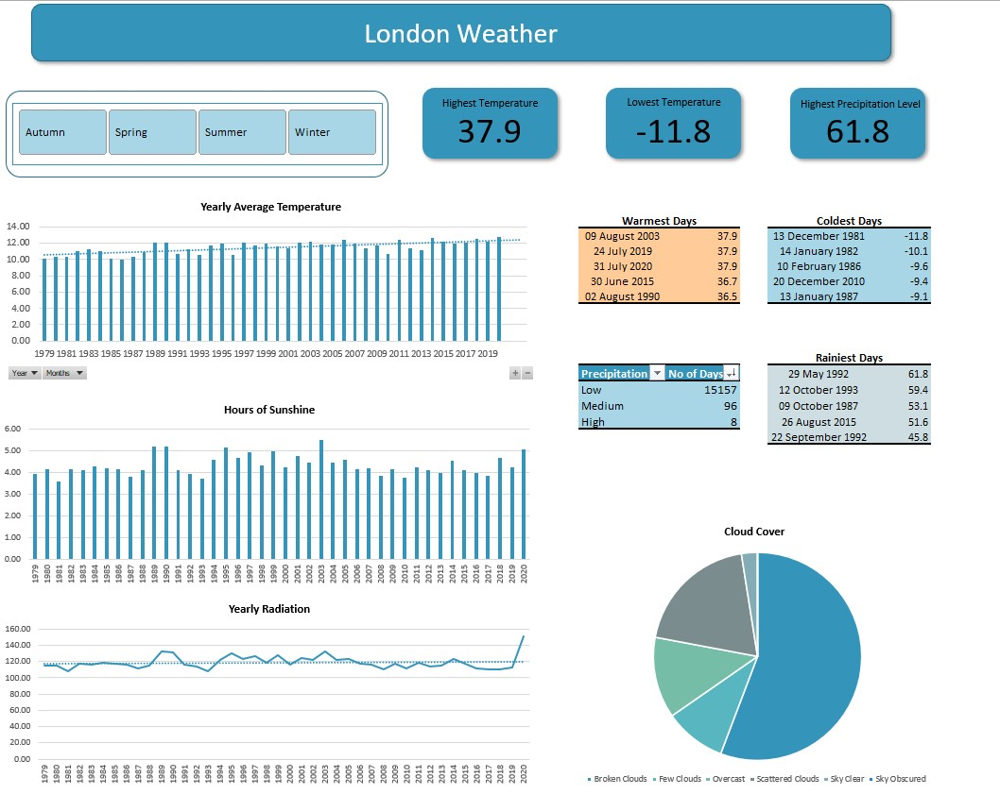

# London_Weather

London weather – cold, dark, and rainy, or is it?
There is no doubt that over the last decades, weather has changed on a global scale. I was curious to find out how has this affected the famous London weather

### Dataset: 
 The dataset for this project can be found on [Kaggle](https://www.kaggle.com/datasets/emmanuelfwerr/london-weather-data). 
 
The dataset  includes the following attributes:
- Date - recorded date of measurement 
- Cloud cover - cloud cover measurement in oktas 
- Sunshine - sunshine measurement in hours
- Global Radiation - irradiance measurement in Watt per square meter (W/m2)
- Max Temp - maximum temperature recorded in degrees Celsius (°C)
- Mean Temp - mean temperature in degrees Celsius (°C)
- Min Temp - minimum temperature recorded in degrees Celsius (°C)
- Precipitation - precipitation measurement in millimetres (mm)
- Pressure - pressure measurement in Pascals (Pa)
- Snow depth - snow depth measurement in centimetres (cm) 

 
 ### Project Overview: 
 In this project, I analysed London Weather from 1979 to 2020. The focus was on analysing and detecting any noticeable changes in the weather conditions during this period.
  
  ### Tools:
  MS Excel
  
  ### Project Steps:
  #### 1. Load the .csv file into MS Excel
  
  #### 2. Data cleaning and preparation
  - handling NULL values:
    - 'snow depth' column had a great number of null values – this made me remove the entire column so I could conduct my analysis without errors;
    - the rest of the columns contained a total of 96 blank cells spread across them -> I removed the rows with blank cells;
  - data formatting:
    - formatted the 'Date' column as date;
    - all the other columns were numeric values, so I formatted the cells as Number
  - new columns:
     - I extracted the 'Month' from the date column -> this allowed me to create another column, ‘Season’, using a nested IF statement;
     - I created a column ‘Sky Cover’ based on the ‘Cloud Cover’ column, using nested IF statements (I used the World Meteorological Organization classification system:
       - 0 => Sky clear
       - 1/2 => Few Clouds
       - 3/4=> Scattered Clouds
       - 5/6/7 => Broken Clouds
       - 8 => Overcast
       - 9 => Sky Obscured
     - I created a column ‘Precipitation Level’ using nested IF statements according to [weatherwatch.co.nz](https://www.weatherwatch.co.nz/content/education-the-most-accurate-ways-to-read-a-rain-forecast-get-fewer-false):
       - < 20 mm => low 
       - 20 -> 40 => moderate
       - 	>= 40 => high
  - formatted as table

 
 #### 3. Data exploration
 -	On a different worksheet, I used Pivot Tables to explore and use then for my visualizations;
 -	I also used a different worksheet to filter my data and create tables: warmest days, coldest days, rainiest days.
  
  #### 4. Data visualization
  
  
  
#### Key findings: 
-	The highest recoded temperature was 37.9 °C  
-	The lowest temperature recorder was -11.8 °C on 13th December 1981. To note is , that 4 out of the 5 lowest temperatures recoded were measured in the ‘80s
-	The average temperature increased over the 40-year period with approx. 2 °C. This is true for every season.  Based on this data, the forecast is for the temperatures to continue to increase
-	The rainiest day was 29th May 1992 when 61.8 mm of rainfall were measured. Besides a few clear exceptions, most of the time the precipitation level remained low
-	2003 was the sunniest year, having 5.49 hours of sunshine on average, however, the sunniest summer happened in 1989 with an average of 8.7 hours of sunshine.
-	When we look at sun radiation, on average, it doesn’t appear to have suffered many changes over the period. However, it is to note that 2020 had noticeably the highest mean radiation.
-	The sky is indeed, covered by clouds most of the time.

#### Conclusion:
By examining this dataset, we can observe a clear and significant increase in the average temperature in London over the 40-year period, amounting to 2°C. This equates to an average of 0.5 °C per decade, highlighting a notable change in the long-term climate trend. Thes findings serve as a reminder that our planet is steadily becoming warmer

It is essential for all of us to be proactive in our efforts to combat climate change, as the consequences affect not only our immediate surroundings but also the global ecosystem. By embracing more sustainable practices and raising awareness about the importance of environmental responsibility, we can work towards a more sustainable future for ourselves and future generations.

   

  
 
